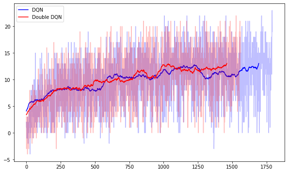

## Introduction

This project shows the ability of a deep reinforcement learning based autonomous agent to navigate a 3D environment and achieve certain objectives that represent a reward while avoiding unfavorable events. We specifically use DQN and Double DQN agents with experience replay buffers to solve the problem.

## Environment
The target environment is based on Unity ML-Agents. It consists of a large square world cordoned with walls and randomly placed yellow and blue bananas. The agent received a +1 reward for collecting a yellow banana and -1 for collecting a blue banana.

### State and Action Space
The state space has 37 dimensions and contains the agent's velocity, along with ray-based perception of objects around the agent's forward direction. Given this information, the agent has to learn how to best select actions. Four discrete actions are available, corresponding to:

`0` - move forward.

`1` - move backward.

`2` - turn left.

`3` - turn right.

The task is episodic, and in order to solve the environment, the agent must get an average score of +13 over 100 consecutive episodes.

## Learning Algorithms

We used two learning agents to solve the environment and to compare their relative efficiency in solving the problem, by comparing how soon each reaches the goal. We used a DQN with fixed targets and a Double DQN agent.
|Parameter|DQN|Double DQN|
|---------|-----|--------|
|discount factor|0.98|0.98|
|learning rate|1e-3|1e-3|
|start epsilon|0.1|0.1|
|stop epsilon|0.01|0.01|
|tau|0.4|0.4|

### Replay Buffer
We also used a replay buffer for storing and sampling experiences. The replay buffer also uses a minimum size before sampling begins to enable sufficient mixing of samples.
|Parameter|Value|
|---------|-----|
|buffer size|4096|
|min samples|2048|
|batch size|64|
|update every|64|

### Neural Network
We used a neural network with two hidden layers as a Q-value function approximator. Following table summarizes the neural network architecture.
|Layer|Width|Activation|
|-----|-----|----------|
|hidden 1|64|relu|
|hidden 2|64|relu|
|output|4|none|

## Results
Both DQN and Double DQN agents were able to solve the environment. DQN was able to achieve average score of 13 at episode 1792 whereas Double DQN accomplished the task at episode 1560. Following graph shows and compares the progression of scores achieved by both agents.

## Improvements
1. ### Prioritized Experience Replay
Our Replay Buffer currently uses uniform sampling of experience tuples. We can modify this to a prioritized experience replay where experience tuples that have a higher temporal error are prioritized during sampling. This has been shown to improve performance significantly.

2. ### Hyperparameter Search
We can try tuning the hyperparameters of the agents and replay buffers to find more appropriate values. We couldn't do a parameter search because of limited computing resources.

3. ### Algorithm Changes
We can also try to implement other algorithms that have been shown to offer better performance than what we've implemented. Dueling DQN and RAINBOW based agents can be tried to achieve better results.
