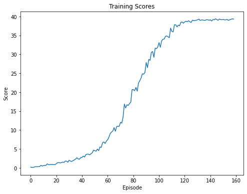
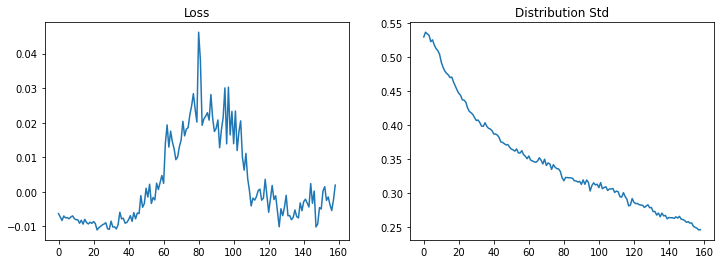

## Introduction

In this project, we train an agent to control a double jointed robotic arm. The robotic arm's effector is required to be in a target 3D space to be successful. We created a PPO and an A2C agent to achieve this goal. The A2C agent wasn't quite successful in achieving the goal in a reasonable time, whereas PPO achieved the target very fast.

## Environment

The target environment is based on Unity ML-Agents. A reward of `+0.1` is provided for each step that the agent's hand is in the goal location. Thus, the goal of the agent is to maintain its position at the target location for as many time steps as possible.

The task is episodic, and in order to solve the environment, the agent must get an average score of +30.0 over 100 consecutive episodes.

## State and Action Spaces

The observation space consists of `33` variables corresponding to position, rotation, velocity, and angular velocities of the arm.  Each action is a vector with four numbers, corresponding to torque applicable to two joints.  Every entry in the action vector must be a number between `-1` and `1`.

## Learning Algorithms

Our successful agent achieved the goal in a reasonable time using PPO. The output of the neural network used is modeled using normal distributions. For each action, we generate action mean and standard deviation. We used two hidden layers with 128 nodes for both actor and critic networks. Tanh activation function is used for both networks.

Following are the parameters used:

|Parameter|Value|
|---|---|
|learning rate - actor|1e-3|
|learning rate - critic|1e-3|
|discount factor|0.99|
|minibatch epochs|8|
|eps clip|0.2|
|trajectory length|1000|
|gae lambda|0.95|

## Results

PPO agent was able to solve the environment very quickly. It achieved an average score of +30.0 over 100 consecutive episodes on episode 159. In fact, we can see the score settle at around 40.0. Following plot shows the score per episode.

We also visualized the loss per episode and the mean of predicted standard deviations of the actions.

## Improvements

Our PPO agent implementation worked extremely well. The score seems to saturate at around 40.0, which is around the maximum score that can be achieved. We have already implemented GAE with PPO agent. We have also modelled the mean and variance of the actions using normal distributions. At this point, tuning the hyperparameters of the agent might yield slightly better results, but there isn't much room for improvement.