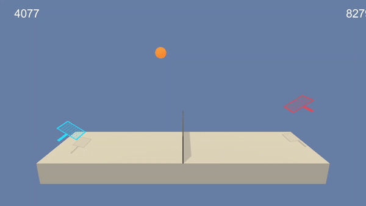

# Project 3: Collaboration and Competition



### Introduction

This project aims to train an agent to play tennis with another replica of itself.

If an agent hits the ball over the net, it receives a reward of +0.1.  If an agent lets a ball hit the ground or hits the ball out of bounds, it receives a reward of -0.01.  Thus, the goal of each agent is to keep the ball in play.

The observation space consists of 8 variables corresponding to the position and velocity of the ball and racket. Each agent receives its own, local observation.  Two continuous actions are available, corresponding to movement toward (or away from) the net, and jumping. 

The task is episodic, and in order to solve the environment, the agents must get an average score of +0.5 (over 100 consecutive episodes, after taking the maximum over both agents). Specifically,

- After each episode, we add up the rewards that each agent received (without discounting), to get a score for each agent. This yields 2 (potentially different) scores. We then take the maximum of these 2 scores.
- This yields a single **score** for each episode.

The environment is considered solved, when the average (over 100 episodes) of those **scores** is at least +0.5.

### Getting Started

1. Download the environment from one of the links below.  You need only select the environment that matches your operating system:
    - Linux: [click here](https://s3-us-west-1.amazonaws.com/udacity-drlnd/P3/Tennis/Tennis_Linux.zip)
    - Mac OSX: [click here](https://s3-us-west-1.amazonaws.com/udacity-drlnd/P3/Tennis/Tennis.app.zip)
    - Windows (32-bit): [click here](https://s3-us-west-1.amazonaws.com/udacity-drlnd/P3/Tennis/Tennis_Windows_x86.zip)
    - Windows (64-bit): [click here](https://s3-us-west-1.amazonaws.com/udacity-drlnd/P3/Tennis/Tennis_Windows_x86_64.zip)
    

2. Place the file in the DRLND GitHub repository, in the `p2_continuous-control/` folder, and unzip (or decompress) the file. Enter the path of the file in the `Continuous_Control.ipynb` notebook while initializing the environment.
   ```
   env = UnityEnvironment(file_name="Reacher.exe")
   ```

### Instructions
Follow the instructions in `Tennis.ipynb` to get started with training your own agent!  

### Description
|File|Description|
|---|---|
|`Tennis.ipynb`|main notebook for training and evaluation|
|`agent/ppo.py`|PPO agent implementation|
|`agent/model.py`|Actor Critic PyTorch network|
|`agent/trainer.py`|Training utility class|
|`agent/buffers.py`|Rollout and trajectory buffers|
|`checkpoints/ppo_checkpoint_12199.pth`|trained PPO agent weights|
|`images/trained.gif`|animated trained agent visualization|
