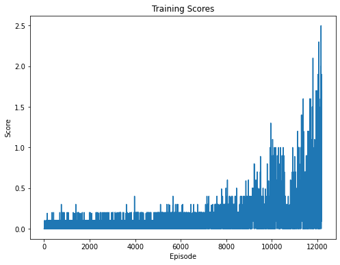

## Introduction

In this project, we train an agent to play tennis against an instance of itself. We created a PPO agent and implemented online trajectory batching to train the agent reliably.

## Environment

In this environment, two agents control rackets to bounce a ball over a net. If an agent hits the ball over the net, it receives a reward of +0.1. If an agent lets a ball hit the ground or hits the ball out of bounds, it receives a reward of -0.01. Thus, the goal of each agent is to keep the ball in play.

The task is episodic, and in order to solve the environment, the agents must get an average score of +0.5 (over 100 consecutive episodes, after taking the maximum over both agents).

After each episode, we add up the rewards that each agent received (without discounting), to get a score for each agent. This yields 2 (potentially different) scores. We then take the maximum of these 2 scores.
This yields a single score for each episode.
The environment is considered solved, when the average (over 100 episodes) of those scores is at least +0.5.

## State and Action Spaces

The observation space consists of 8 variables corresponding to the position and velocity of the ball and racket. Each agent receives its own, local observation. Two continuous actions are available, corresponding to movement toward (or away from) the net, and jumping.

## Learning Algorithms

Our initial implementation using PPO agent was not very successful as the variance of the rewards was very high. This was predictable as the agent would be succesful in scoring a point after a lot of tries, and subsequent unsuccessful attempts would lead to catastrophic unlearning.

The environment we are using only allowed for a single game to be played at a time, whereas PPO needs a lot of simultaneous experiences to learn from. This is why we used a batching approach to train the agent.

For each episode, we collect experience data in currently active trajectory buffer. When the episode ends, we add this trajectory to a trajectory buffer and start a new trajectory. When trajectory buffer is full, we combine all the trajectory vectors together. The issue with this is that the episodes are not necessarily of the same length.

For dealing with this, we pad the shorter trajectories with zeros. We also create a mask that indicates which experience values are valid in the combined trajectory. When learning from the combined trajectory, we multiply the mask to **advantages** for masking policy updates from empty states, and with **state_values** for masking value updates from empty states. 

Each episode trajectory two agent trajectories, one for each agent. In our final solution, we used 200 trajectories per training batch. This approach helped reduce the learning variance a lot and our agent performed significantly better.

Following are the parameters used:

|Parameter|Value|
|---|---|
|learning rate - actor|1e-3|
|learning rate - critic|1e-3|
|discount factor|0.99|
|minibatch epochs|4|
|eps clip|0.1|
|trajectory length|1000|
|trajectory batch size|100|

## Results

Our PPO based approach was able to learn reliably in the environment. From the score plot below, we can see it shot past the target average score of 0.5 and towards the end of training was achieving a score of 2.6 which is the maximum score that we could achieve. We set a limit on the trajectory length to 1000 to avoid very long episodes as an episode can theoretically be played till infinity.

We also visualized the loss per episode and the mean of predicted standard deviations of the actions.

## Improvements

Our PPO agent implementation worked extremely well. We can further improve the agent with minor changes. 

Firstly, when we used masking in the combined trajectories, we did not adjust the loss functions to account for mean squared error for critic and mean ratio errors for actor. We can correct that by manually counting the number of valid experiences from the mask and adjusting the loss functions accordingly.

Secondly, we can implement Generalized Advantage Estimation (GAE) and tune it to improve the learning of the agent.

We can also try to use a Recurrent Neural Network (RNN) instead of a feed forward network for policy and critic networks. This can allow the agent to more accurately predict the incoming trajectory of the tennis ball.